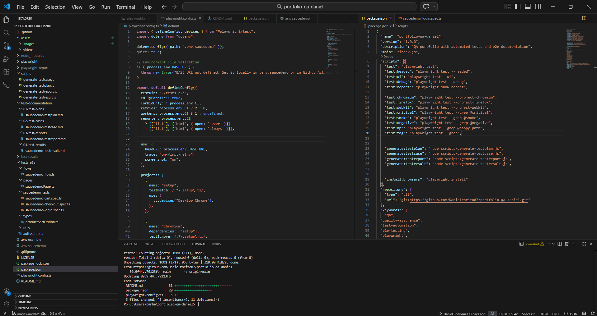
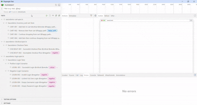
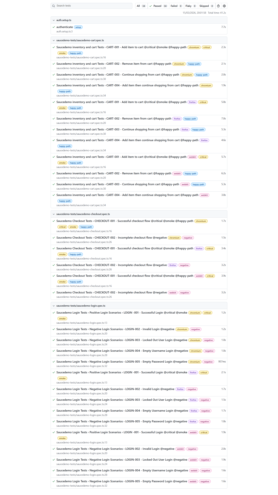
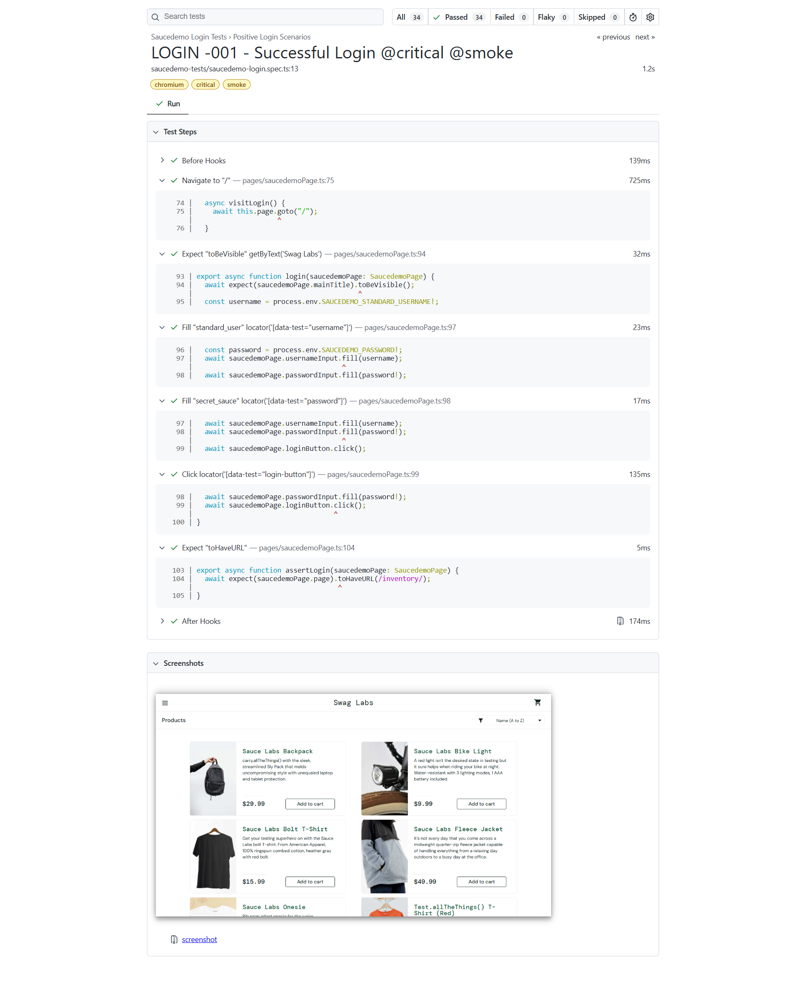
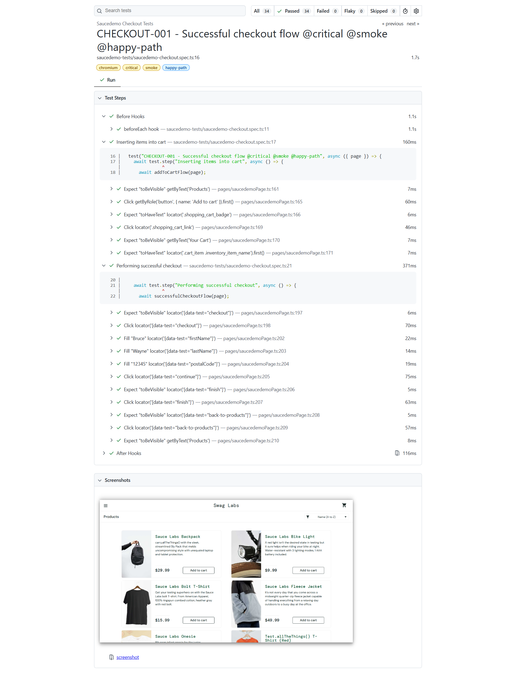
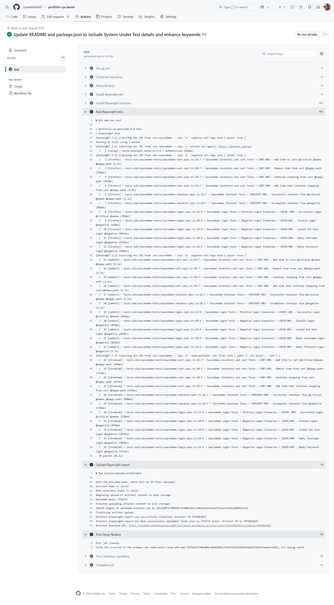

[](https://playwright.dev)
[](https://www.typescriptlang.org/)
[](https://nodejs.org)
[](https://github.com/features/actions)
[](https://github.com/Danielrbrito07)
[](https://github.com/Danielrbrito07/portfolio-qa-daniel)

# Portfólio de QA – Daniel Brito

🇺🇸 [Read in English](./README.md)

Este repositório contém meu **portfólio de Quality Assurance**, apresentando exemplos práticos de **documentação de testes, estratégia de testes e automação**.

O objetivo deste projeto é demonstrar minha abordagem em relação à **qualidade de software, processos de teste e práticas de automação** utilizadas em ambientes reais.

---

# Sobre este Repositório

Este portfólio foi criado para demonstrar minhas habilidades como **Analista de Quality Assurance (QA)**, incluindo:

- Planejamento e estratégia de testes  
- Testes manuais  
- Design de casos de teste  
- Reporte de bugs  
- Automação de testes com Playwright  
- Documentação e relatórios de testes  

O repositório está estruturado para simular como os artefatos de testes são organizados em projetos reais de QA.

---

## Sistema em Teste (SUT)

Este projeto utiliza a aplicação web **SauceDemo** como sistema em teste.

O SauceDemo é uma plataforma de e-commerce utilizada para práticas de testes e automação em QA.

🔗 URL da aplicação: https://www.saucedemo.com/

Os testes automatizados validam fluxos críticos como:

- Autenticação de usuários  
- Navegação no catálogo de produtos  
- Gerenciamento do carrinho  
- Processo de checkout  

O objetivo é demonstrar um **fluxo realista de automação de QA**, incluindo:

- Documentação de testes  
- Automação End-to-End  
- Execução em pipeline CI  
- Organização de artefatos de teste  

---

# Estrutura do Repositório

```text
portfolio-qa-daniel
|
├── .github
│   └── workflows
│       └── playwright.yml        # Pipeline CI para execução dos testes
│
├── test-documentation            # Documentação de QA
│   ├── 01-test-plans
│   ├── 02-test-cases
│   ├── 03-test-reports
│   └── 04-test-results
│
├── tests-e2e                     # Testes automatizados E2E (Playwright)
│   ├── data                      
│   ├── types                     
│   ├── utils                     
│   ├── pages                     
│   ├── flows                     
│   └── tests           
│
├── scripts                       # Scripts para geração de artefatos de QA
│   ├── generate-testplan.js
│   ├── generate-testcases.js
│   ├── generate-testreport.js
│   └── generate-testresults.js
│
└── assets                        # Evidências de testes (imagens, vídeos, relatórios)
    ├── images
    └── videos
``` 

### Documentação de Teste

Contém exemplos de documentação profissional de QA:

- **Plano de Teste**
- **Casos de Teste**
- **Report de Teste**
- **Relatórios de Teste** 

Esses documentos demonstram como as atividades de teste são planejadas, executadas e reportadas.

---

# Testes Automatizados

Os testes automatizados foram implementados utilizando:

- **Playwright**
- **TypeScript** 

A automação é focada em testes End-to-End (E2E), validando fluxos críticos do ponto de vista do usuário final.

Exemplos de cenários testados:

- Login 
- Interação com os produtos
- Processo de Checkout
- Validações de erro

---

# Tecnologias Utilizadas

- Playwright
- TypeScript
- Node.js
- Git
- GitHub

Conceitos de teste aplicados:

- Testes End-to-End
- Testes Funcionais
- Testes Negativos
- Testes de Regressão
- Documentação de Testes

# Estrutura do Framework de Automação

Abaixo está uma visão geral da estrutura do projeto utilizada para organizar os testes automatizados, documentação e utilitários de suporte.


---

# Como Executar os Testes

### 1 - Clone o repositório

git clone https://github.com/Danielrbrito07/portfolio-qa-daniel.git

### 2 - Navegue até a pasta do projeto

cd portfolio-qa-daniel

### 3 - Instale as dependências

npm install

### 4 - Instale os navegadores do Playwright

npx playwright install

### 5 - Crie o arquivo .env.saucedemo

Crie um arquivo `.env` seguindo o env exemplo `.env.example`

### 6 - Execute os testes

npm run test

# Scripts Disponíveis

Este projeto inclui scripts para execução de testes e geração de documentação de testes.

## Execução de Testes

Os seguintes scripts executam testes automatizados usando Playwright.

| Script                | Descrição                              |
| --------------------- | -------------------------------------- |
| `npm run test`        | Executa todos os testes automatizados  |
| `npm run test:headed` | Executa testes com o navegador visível |
| `npm run test:ui`     | Executa testes no modo UI do Playwright |
| `npm run test:report` | Abre o relatório HTML de testes do Playwright |

### Testes Cross-Browser

| Script                  | Descrição              |
| ----------------------- | ---------------------- |
| `npm run test:chromium` | Executa testes no Chromium |
| `npm run test:firefox`  | Executa testes no Firefox  |
| `npm run test:webkit`   | Executa testes no WebKit   |

### Execução de Testes com Tags

Estes scripts permitem executar grupos específicos de testes usando tags.

| Script                  | Descrição                              |
| ----------------------- | -------------------------------------- |
| `npm run test:critical` | Executa testes marcados com **@critical** |
| `npm run test:smoke`    | Executa os smoke tests|
| `npm run test:negative` | Executa cenários de testes negativos  |
| `npm run test:hp`       | Executa testes do "caminho feliz"       |
| `npm run test:tag`      | Executa testes filtrados por uma tag personalizada |

## Geração de Documentação de Testes

Os seguintes scripts geram artefatos de documentação de QA.

Cada artefato gerado é automaticamente salvo em seu diretório correspondente dentro da pasta Documentação de Testes.

| Script                               | Descrição                        | Diretório de Saída                |
| ------------------------------------ | -------------------------------- | --------------------------------- |
| `npm run generate:testplan <name>`   | Gera um Plano de Teste          | `Documentação de Testes/Plano de Teste` |
| `npm run generate:testcase <name>`   | Gera documentação de Casos de Teste | `Documentação de Testes/Casos de Teste` |
| `npm run generate:testreport <name>` | Gera um Relatório de Teste      | `Documentação de Testes/Relatórios de Teste` |
| `npm run generate:testresult <name>` | Gera resumos de Resultados de Teste | `Documentação de Testes/Resultados de Teste` |

Estes scripts requerem um parâmetro de nome, que será usado como o nome do artefato gerado.

Exemplo:

npm run generate:testplan checkout-feature

Este comando gerará um documento de Plano de Teste nomeado checkout-feature e o salvará no diretório apropriado.

# Exemplos de Documentação de Teste

Dentro da pasta Documentação de Testes você encontrará exemplos de:

- Planos de Teste
- Casos de Teste Estruturados
- Critérios de Aceitação
- Relatórios de Bugs
- Relatórios de Teste

# Propósito deste Portfólio

Este repositório tem como objetivo demonstrar:

- Documentação realista de QA
- Práticas de design de testes
- Habilidades de automação
- Organização de artefatos de testes
- Mentalidade focada em qualidade

# Evidência de Testes

As imagens a seguir apresentam a execução e o relatório do conjunto de testes automatizados.

Incluem exemplos do executor da UI do Playwright e dos relatórios HTML gerados, que fornecem informações detalhadas sobre a execução dos testes, incluindo testes passou e falharam, rastreamentos e informações de depuração.

Estes artefatos demonstram como os resultados dos testes podem ser analisados e validados em um fluxo de trabalho real de automação de QA.

### Interface da UI

Exemplo de testes automatizados sendo executados localmente usando a interface da UI do Playwright.



### Relatório HTML

Exemplo do relatório HTML gerado após a execução dos testes, mostrando resultados detalhados, etapas de teste e status de execução.





### Testes do Pipeline CI

Exemplo do conjunto de testes automatizados sendo executado através de um pipeline CI do GitHub Actions.

O pipeline instala dependências, executa o conjunto de testes Playwright e gera relatórios de testes como artefatos.




# Contato
- [LinkedIn](https://www.linkedin.com/in/daniel-rodriguesbrito/)
- [GitHub](https://github.com/Danielrbrito07)
