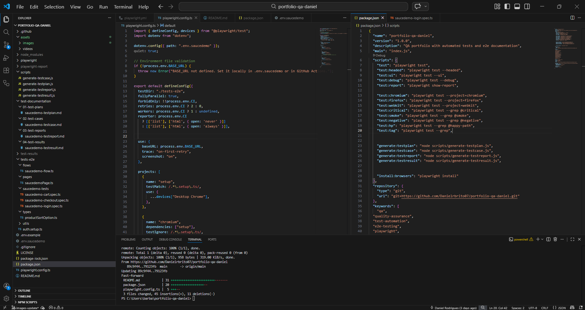
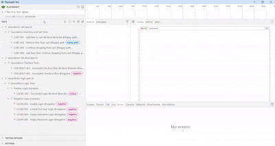
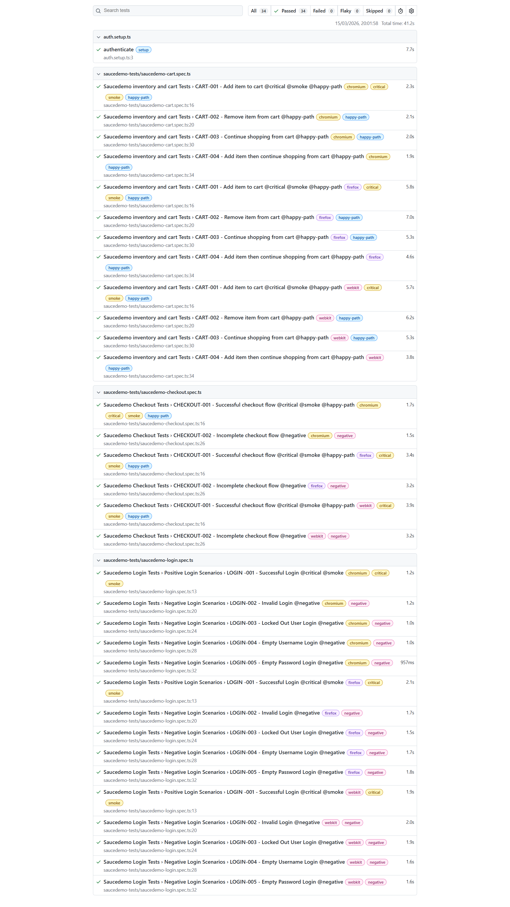
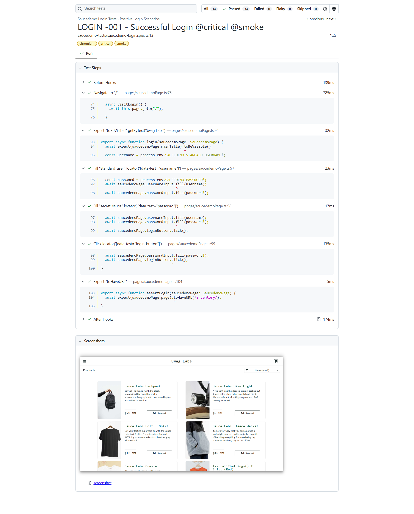
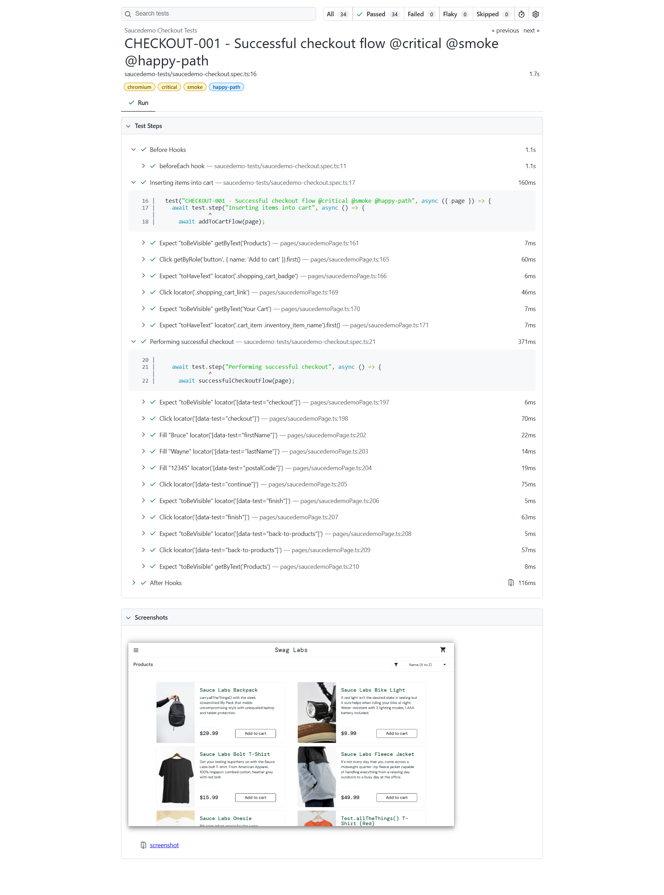
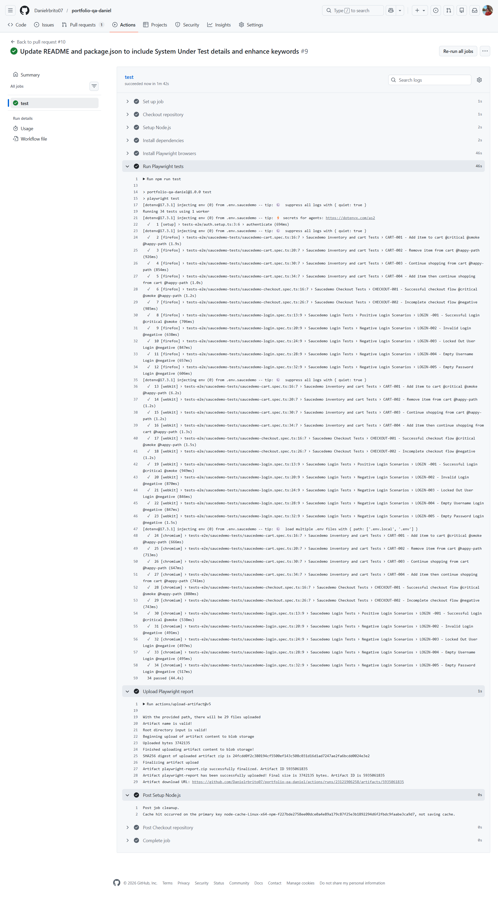

[](https://playwright.dev)
[](https://www.typescriptlang.org/)
[](https://nodejs.org)
[](https://github.com/features/actions)
[](https://github.com/Danielrbrito07)
[](https://github.com/Danielrbrito07/portfolio-qa-daniel)

# QA Portfolio – Daniel Brito

This repository contains my **Software Quality Assurance portfolio**, showcasing practical examples of **test documentation, test strategy, and automated testing**.

The goal of this project is to demonstrate my approach to **software quality, testing processes, and automation practices** used in real-world environments.

---

# About this Repository

This portfolio was created to demonstrate my skills as a **Quality Assurance Analyst**, including:

- Test planning and test strategy
- Manual testing
- Test case design
- Bug reporting
- Automated testing with Playwright
- Test documentation and reporting

The repository is structured to simulate how testing artifacts are organized in real QA projects.

---

## System Under Test (SUT)

This project uses the web application **SauceDemo** as the system under test.

SauceDemo is a sample e-commerce platform commonly used for testing practice and QA automation exercises.

🔗 Application URL: https://www.saucedemo.com/

The automated tests validate critical user flows such as:

- User authentication
- Product inventory browsing
- Cart management
- Checkout process

The goal of this project is to demonstrate a **realistic QA automation workflow**, including:

- Test documentation
- End-to-end test automation
- CI pipeline execution
- Structured test artifacts

# Repository Structure

```text
portfolio-qa-daniel
|
├── .github
│   └── workflows
│       └── playwright.yml        # CI pipeline for automated tests
│
├── test-documentation            # QA documentation examples
│   ├── 01-test-plans
│   ├── 02-test-cases
│   ├── 03-test-reports
│   └── 04-test-results
│
├── tests-e2e                     # Playwright E2E automated tests
│   ├── data                      
│   ├── types                     
│   ├── utils                     
│   ├── pages                     
│   ├── flows                     
│   └── tests           
│
├── scripts                       # Scripts to generate QA artifacts
│   ├── generate-testplan.js
│   ├── generate-testcases.js
│   ├── generate-testreport.js
│   └── generate-testresults.js
│
└── assets                        # Test evidence (screenshots, reports, videos)
    ├── images
    └── videos
```

### Test Documentation

Contains examples of professional QA documentation:

- **Test Plan**
- **Test Cases**
- **Test Strategy**
- **Test Reports**

These documents demonstrate how testing activities are planned, executed, and reported.

---

# Automated Testing

Automated tests were implemented using:

- **Playwright**
- **TypeScript**

The automation focuses on **End-to-End (E2E) testing**, validating key user flows and ensuring system behavior from an end-user perspective.

Examples of tested flows include:

- Login
- Product interaction
- Checkout process
- Error validations

---

# Technologies Used

- Playwright
- TypeScript
- Node.js
- Git
- GitHub

Testing concepts applied:

- End-to-End Testing
- Functional Testing
- Negative Testing
- Regression Testing
- Test Documentation

# Automation Framework Structure

Below is an overview of the project structure used to organize the automated tests, documentation, and supporting utilities.


---

# How to Run the Tests

### 1 - Clone the repository

git clone https://github.com/Danielrbrito07/portfolio-qa-daniel.git

### 2 - Install dependencies

npm install

### 3 - Install playwright browsers

npx playwright install

### 4 - Create .env.saucedemo file

Create a `.env` file based on `.env.example`

### 4 - run tests

npm run test

# Available Scripts

This project includes scripts for test execution and test documentation generation.

## Test Execution

The following scripts run automated tests using Playwright.

| Script                | Description                           |
| --------------------- | ------------------------------------- |
| `npm run test`        | Runs all automated tests              |
| `npm run test:headed` | Runs tests with the browser visible   |
| `npm run test:ui`     | Runs tests in Playwright UI mode      |
| `npm run test:report` | Opens the Playwright HTML test report |

### Cross-Browser Testing

| Script                  | Description            |
| ----------------------- | ---------------------- |
| `npm run test:chromium` | Runs tests in Chromium |
| `npm run test:firefox`  | Runs tests in Firefox  |
| `npm run test:webkit`   | Runs tests in WebKit   |

### Tagged Test Execution

These scripts allow running specific test groups using tags.

| Script                  | Description                          |
| ----------------------- | ------------------------------------ |
| `npm run test:critical` | Runs tests tagged with **@critical** |
| `npm run test:smoke`    | Runs smoke tests                     |
| `npm run test:negative` | Runs negative test scenarios         |
| `npm run test:hp`       | Runs happy path tests                |
| `npm run test:tag`      | Runs tests filtered by a custom tag  |

## Test Documentation Generation

The following scripts generate QA documentation artifacts.

Each generated artifact is automatically saved in its corresponding directory inside the Test Documentation folder.

| Script                               | Description                       | Output Directory                  |
| ------------------------------------ | --------------------------------- | --------------------------------- |
| `npm run generate:testplan <name>`   | Generates a Test Plan             | `Test Documentation/Test Plan`    |
| `npm run generate:testcase <name>`   | Generates Test Case documentation | `Test Documentation/Test Cases`   |
| `npm run generate:testreport <name>` | Generates a Test Report           | `Test Documentation/Test Reports` |
| `npm run generate:testresult <name>` | Generates Test Result summaries   | `Test Documentation/Test Results` |

These scripts require a name parameter, which will be used as the name of the generated artifact.

Example:

npm run generate:testplan checkout-feature

This command will generate a Test Plan document named checkout-feature and save it in the appropriate directory.

# Test Documentation Examples

Inside the Test Documentation folder you will find examples of:

- Test Plans
- Structured Test Cases
- Acceptance Criteria
- Bug Reports
- Test Reports

# Purpose of this Portfolio

This repository aims to demonstrate:

- Realistic QA documentation
- Test design practices
- Automation skills
- Organization of testing artifacts
- Quality-focused mindset

# Test Evidence

The following images showcase the execution and reporting of the automated test suite.

They include examples of the Playwright UI runner and the generated HTML reports, which provide detailed insights into test execution, including passed and failed tests, traces, and debugging information.

These artifacts demonstrate how test results can be analyzed and validated in a real-world QA automation workflow.

### UI Interface

Example of automated tests running locally using Playwright UI interface.



### HTML Reporter

Example of the HTML report generated after test execution, showing detailed results, test steps, and execution status.





### CI Pipeline Tests

Example of the automated test suite being executed through a GitHub Actions CI pipeline.

The pipeline installs dependencies, runs the Playwright test suite, and generates test reports as artifacts.



# Contact
- [LinkedIn](https://www.linkedin.com/in/daniel-rodriguesbrito/)
- [GitHub](https://github.com/Danielrbrito07)
